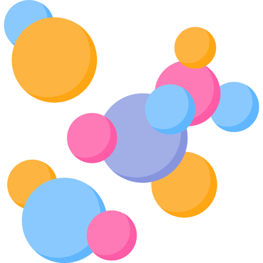

# image-particles-midjourney
An experimental integration with interactive-particles.js and Midjourney | The project creates a vídeo animation based on the user input

[![LinkedIn][linkedin-shield]][linkedin-url]

<h2>Client</h2>

<b>formFun - Brazil </b>

<!-- PROJECT LOGO -->
 

 

  

<h3 align="center">formFun AI Generated Image Particles Animation</h3>

  

An experimental integration with interactive-particles.js and Midjourney | The project creates a vídeo animation based on the user input
 | using Three.js, interactive-particles.js and Midjourney API
  

  
 

https://github.com/victorcappa/image-particles-midjourney/assets/40408965/0f7f19d0-3cea-4f7e-8878-7051feb5267f

https://github.com/victorcappa/image-particles-midjourney/assets/40408965/b28152b0-f825-4333-b307-a12035833dff

<!-- ABOUT THE PROJECT -->
## About The Project

 

 
 
This app is a proof of concept/MVP for a beverage company, combining images from the Midjourney API with a particle effect and camera movement to create a visually captivating animation. It showcases the company's products in an engaging and innovative way.

 

 
  <h3>Challenges</h3
   

The main challenge was integrating the camera movements with the ongoing particle animation. This required careful coordination and precise timing to ensure a seamless experience. However, by overcoming this challenge, I enhanced the overall visual experience and created a captivating presentation.  

(<a href="#top">back to top</a>)

<!-- LICENSE -->
## License

All intellectual property is owned by formFun

<!-- CONTACT -->
## Contact

Reach out - <a href = "mailto: victorcappa@imaginar.dev">Victor Cappa @imaginar</a>
 
<a href="https://www.linkedin.com/in/victor-cappa-50839788/">Linkedin</a>

(<a href="#top">back to top</a>)

[linkedin-shield]: https://img.shields.io/badge/-LinkedIn-black.svg?style=for-the-badge&logo=linkedin&colorB=555
[linkedin-url]: https://www.linkedin.com/in/victor-cappa-50839788/
